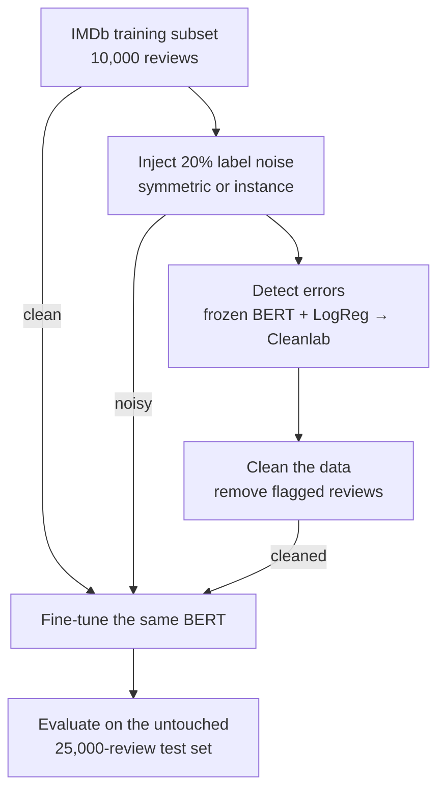
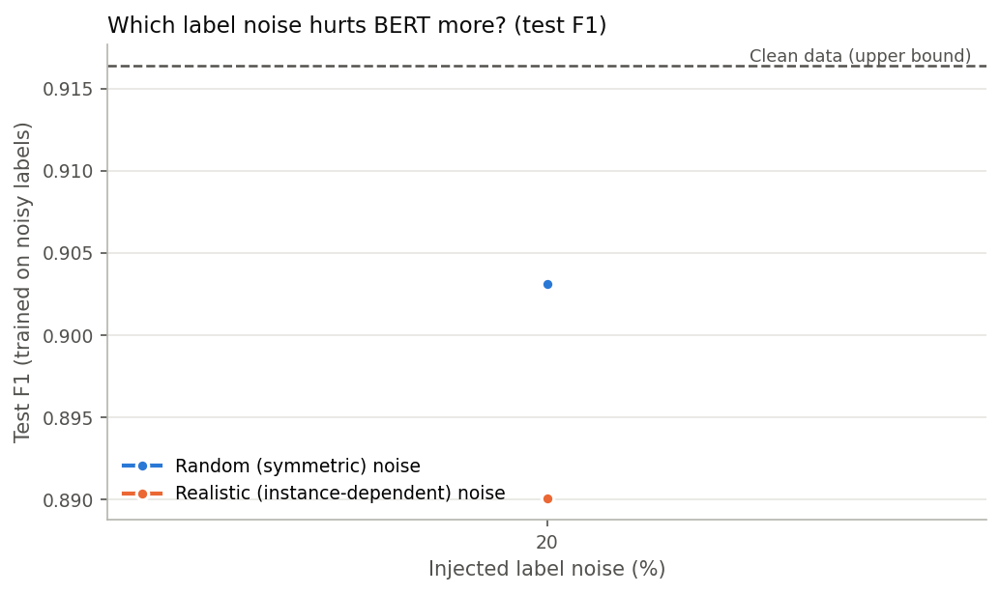
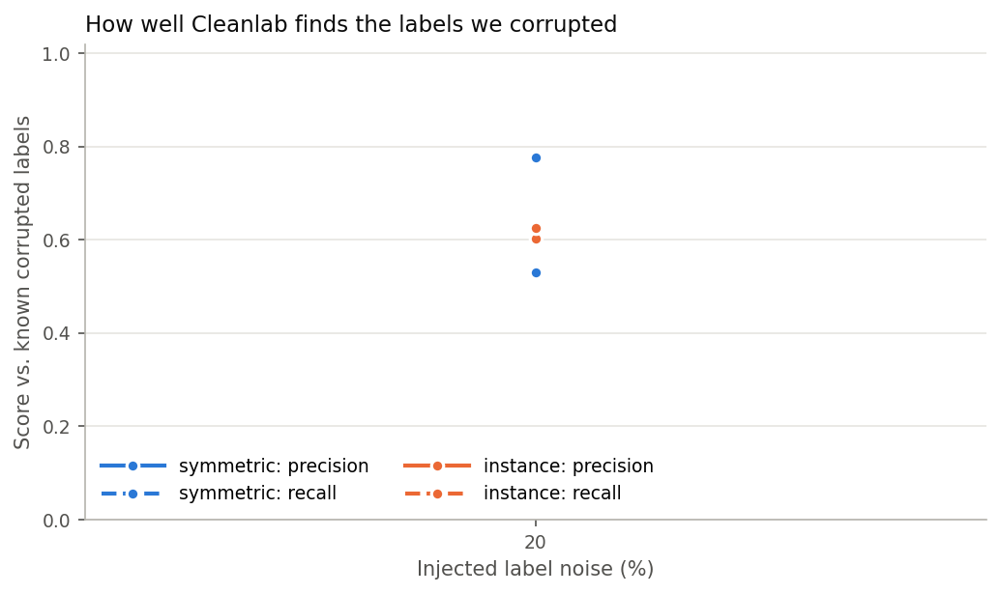
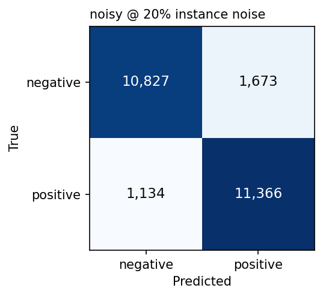
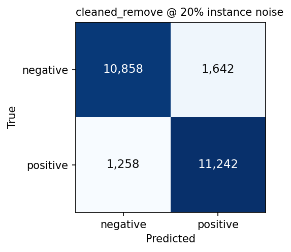

# Data-Centric AI: Label Error Detection and Correction for Sentiment Classification

Can we improve a model by fixing its **training data** instead of changing the **model**?

This project injects known label errors into the IMDb movie-review dataset, uses
[Cleanlab](https://github.com/cleanlab/cleanlab) to find them, cleans the data, and retrains the
**same** BERT model with the **same** settings, evaluated on the **same** untouched test set.
Because the injected errors are known, both the cleaning step and the final model can be graded objectively.

---

## TL;DR

| Finding | Evidence |
|---|---|
| BERT is surprisingly robust to **random** label noise | 20% random flips cost only **1.3 F1 points** (0.916 → 0.903) |
| **Realistic** noise (errors on ambiguous reviews) hurts about **2× more** | 20% realistic flips cost **2.6 F1 points** (0.916 → 0.890) |
| Cleanlab finds most injected errors, with moderate precision | recall **0.63–0.78**, precision **0.53–0.60** |
| Realistic errors are harder to detect than random ones | recall 0.63 vs 0.78 |
| **Removing** flagged examples did **not** recover performance | F1 dropped a further 0.4 points in both cases |
| Cleanlab also surfaced real labeling problems in the original IMDb | 736 suspicious labels in 10,000 reviews (7.4%) |

The main lesson: **finding label errors is not enough. How you act on them matters.** Deleting flagged
rows also removed many correctly labeled, hard examples, and that cost more than the cleaner labels gained.

---

## 1. Research question

> Can systematic detection and correction of mislabeled training examples improve sentiment
> classification while the model architecture and training configuration stay fixed?

Sub-questions:

1. How much does label noise hurt a fine-tuned BERT model?
2. Does the *type* of noise matter: random mistakes vs. realistic annotator-style mistakes?
3. How accurately does Cleanlab find the corrupted labels?
4. Does training on the cleaned data recover the lost performance?

---

## 2. Approach

### 2.1 Pipeline



1. **Inject noise:** flip 20% of the training labels, either at random (**symmetric**) or mostly on
   ambiguous reviews (**instance**). The true labels are kept.
2. **Detect:** Cleanlab flags likely label errors from out-of-fold probabilities. The flags are graded
   against the known flips (precision and recall).
3. **Clean:** remove the flagged reviews. (`relabel` and `hybrid` are also implemented.)
4. **Train and evaluate:** the clean, noisy and cleaned sets each train the same BERT with the same
   settings, and all are scored on the same untouched test set.

### 2.2 Key design decisions

- **The model is fixed; only the data changes.** `bert-base-uncased` is fine-tuned with identical
  hyperparameters in every run, so differences in results come from the training data.
- **The test set is never modified.** Noise is only injected into training data; this is asserted in code and tests.
- **Known ground truth.** The original label of every review is kept, so Cleanlab can be graded exactly.
- **Balanced noise.** The same fraction of labels is flipped in each class, so the class balance never changes.
- **Two noise types:**
  - **Symmetric:** reviews to flip are chosen uniformly at random (the textbook setting).
  - **Instance-dependent:** ambiguous reviews are flipped far more often, like real annotator mistakes.
    Ambiguity is scored by a separate TF-IDF + LogisticRegression model, deliberately different from the
    detector so the noise and the detection stay independent. The flipped reviews were clearly harder:
    their mean ambiguity was **0.371** vs **0.225** for random flips.
- **Cheap detector, expensive evaluator.** Cleanlab needs out-of-sample probabilities. Instead of K-fold
  BERT fine-tuning, a LogisticRegression on *frozen* BERT embeddings gives out-of-fold probabilities in
  seconds. The fine-tuned BERT is used only for the final comparison, which keeps the project within free GPU limits.

### 2.3 Setup

| Item | Value |
|---|---|
| Dataset | IMDb (`stanfordnlp/imdb`), binary sentiment |
| Training set | 10,000 reviews, stratified subset (5,000 / 5,000) |
| Test set | full 25,000 reviews, untouched |
| Model | `bert-base-uncased`, 2 epochs, lr 2e-5, batch 16, max length 256, fp16 |
| Detector | frozen BERT mean-pooled embeddings + 5-fold LogisticRegression → Cleanlab (`prune_by_noise_rate`) |
| Noise | 20%, symmetric and instance-dependent |
| Cleaning strategy evaluated | `remove` (drop every flagged example) |
| Hardware | Google Colab, free T4 GPU (~6–7 min per BERT run) |

---

## 3. Results

All results are for **seed 42**, evaluated on the full 25,000-review test set.

### 3.1 Model quality

| Training data | Train size | Wrong labels in train | Accuracy | F1 | ROC-AUC |
|---|---:|---:|---:|---:|---:|
| **Clean** (upper bound) | 10,000 | 0% | 0.916 | **0.916** | 0.973 |
| Symmetric noise 20% | 10,000 | 20.0% | 0.902 | 0.903 | 0.964 |
| Symmetric noise 20% → remove flagged | 7,069 | 6.3% | 0.900 | 0.899 | 0.963 |
| Instance noise 20% | 10,000 | 20.0% | 0.888 | 0.890 | 0.958 |
| Instance noise 20% → remove flagged | 7,922 | 9.4% | 0.884 | 0.886 | 0.953 |

| Noise type | F1 lost to noise | F1 recovered by cleaning |
|---|---:|---:|
| Symmetric | −1.3 points | −32% (made it worse) |
| Instance | −2.6 points | −16% (made it worse) |



### 3.2 Detection quality (Cleanlab vs. known corrupted labels)

| Noise type | Corrupted labels | Flagged | Correct flags | Precision | Recall | Correctly labeled but removed |
|---|---:|---:|---:|---:|---:|---:|
| Symmetric 20% | 2,000 | 2,931 | 1,554 | 0.53 | 0.78 | 1,377 |
| Instance 20% | 2,000 | 2,078 | 1,253 | 0.60 | 0.63 | 825 |

Instead of reviewing all 10,000 labels, a human reviewer would only need to check the
2,078–2,931 flagged ones, **a 71–79% reduction in manual review**.



### 3.3 Confusion matrices: instance noise 20%

| Trained on noisy labels | Trained after removing flagged labels |
|---|---|
|  |  |

### 3.4 Real label problems in the original IMDb

With **no** injected noise, Cleanlab flagged **736 of 10,000** original labels. The most suspicious ones
are clearly mislabeled. For example, this review is labeled **negative**:

> *"Great movie - especially the music - Etta James - 'At Last'. This speaks volumes when you have finally
> found that special someone."*

Data profiling also found **19** duplicate reviews in the training subset, **201** in the test set, and
**48** test reviews whose exact text also appears in training.

---

## 4. Discussion

**Why random noise barely hurts.** A likely explanation: a pretrained model fine-tuned for only 2 epochs
learns the dominant pattern before it has time to memorize randomly flipped labels. Random errors also tend to sit on easy,
clear-cut reviews, where the model's prior knowledge outweighs the wrong label.

**Why realistic noise hurts more.** Instance-dependent errors concentrate on ambiguous reviews near the
decision boundary. Those are exactly the examples the model needs to learn where the boundary is.

**Why removing flagged examples did not help.**

- Detection precision was only 0.53–0.60, so **825–1,377 correctly labeled reviews were deleted**, along
  with **21–29%** of the training set.
- Those false flags are likely hard, ambiguous reviews, which are among the most informative ones to keep.
- Recall was 0.63–0.78, so **6–9% wrong labels remained** after cleaning.
- Since BERT tolerates noise well, the gain from cleaner labels was smaller than the loss from less, and easier, data.

**Takeaway for practitioners:** label-error detection is a good way to **prioritize human review**.
Blindly deleting flagged examples can hurt a strong pretrained model, so detection precision
should be checked before acting on its flags automatically.

---

## 5. Limitations and next steps

**Limitations**

- **One seed, one noise level (20%).** Differences under ~0.5 F1 points may be within run-to-run variation.
- **Only the `remove` strategy was evaluated with BERT.**
- **The detector is weak.** Frozen embeddings with a linear model limit Cleanlab's precision and recall.
- **Subset size.** The 10,000-review training subset was used to fit free GPU limits.

**Next steps** (the pipeline already supports most of these through `config.yaml`):

1. Use a stronger detector: out-of-fold probabilities from fine-tuned BERT (K-fold cross-fitting).
2. Evaluate `hybrid` (relabel confident flags, remove the rest) and `relabel`, which keep more data.
3. Run 3 seeds × noise levels 10/20/30% for both noise types.
4. Try down-weighting flagged examples instead of deleting them.

---

## 6. Repository structure

```
├── config.yaml          # every experiment setting (single source of truth)
├── main.ipynb           # Colab orchestrator: calls src/, contains no logic
├── src/
│   ├── data.py          # load IMDb, profile, ambiguity scores, noise injection
│   ├── cleaning.py      # out-of-fold probabilities, Cleanlab, remove/relabel/hybrid
│   ├── model.py         # BERT embeddings + fine-tuning; TF-IDF stand-ins for local runs
│   ├── evaluate.py      # classification, detection and recovery metrics + figures
│   ├── pipeline.py      # resumable experiment loop + command-line entry point
│   └── utils.py         # config, seeding, result logging
├── tests/               # pytest suite: offline, runs in seconds
└── results/
    ├── experiments.csv  # one row per run (noise type, rate, seed, dataset, metrics)
    ├── label_issues/    # flagged examples per run, for error analysis
    └── figures/
```

**Engineering features**

- **Resumable experiments:** every finished run is appended to `experiments.csv`, and reruns skip
  finished work, so free Colab disconnects lose at most one run.
- **Reproducible:** all randomness is seeded, and all settings live in `config.yaml`.
- **Tested:** 39 tests cover noise injection, metrics, cleaning, the experiment loop and resuming.

---

## 7. How to run

**Locally (CPU, no BERT):**

```bash
pip install -r requirements.txt
pytest                                                  # 39 passed, 2 skipped
python -m src.pipeline --mode dry-run --n-train 1000 --n-test 1000
```

The dry run uses real IMDb data, with TF-IDF stand-ins in place of BERT.

**Google Colab (GPU, the real experiment):**

1. Open `main.ipynb` from GitHub in Colab and select a **T4 GPU** runtime.
2. Run all cells. Results are saved to Google Drive and resume automatically after a disconnect.
3. Section 11 downloads a `results_bundle.zip`. Unzip it into `results/`.

---

## Tech stack

Python · PyTorch · Hugging Face Transformers & Datasets · Cleanlab · scikit-learn · pandas · matplotlib · pytest · Google Colab